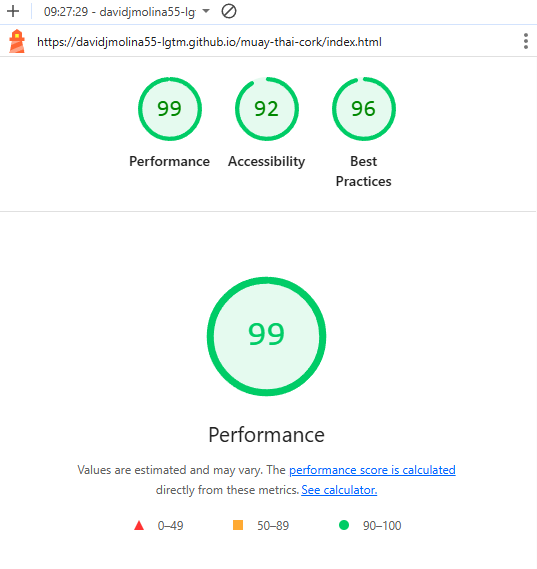

# Muay Thai Cork - Martial Arts Gym Website

A modern, responsive website for Muay Thai Cork, a martial arts gym located in Cork, Ireland. This website showcases the gym's classes, schedules, and provides essential contact information for potential members.

## About Muay Thai Cork

Muay Thai Cork specializes in "The Art of Eight Limbs" - traditional Thai boxing that emphasizes striking techniques using fists, elbows, knees, and shins. We welcome people from all backgrounds, whether new to combat sports or returning practitioners.

## Features

### Responsive Design

-   **Mobile-First Approach**: Fully optimized for all device sizes
-   **Responsive Navigation**: Collapsible navbar for mobile devices
-   **Mobile-Optimized Cards**: Class information cards that stack properly on mobile
-   **Touch-Friendly Interface**: Adequate spacing and sizing for mobile interaction

### Homepage (index.html)

-   **Hero Section**: Eye-catching introduction with gym philosophy
-   **Core Values**: Highlighting the gym's welcoming, no-ego environment
-   **Image Carousel**: Rotating gallery of gym activities and training
-   **Classes Section**: Detailed information about available programs:
    -   Adults Muay Thai (Fitness)
    -   Adults Muay Thai (Sparring)
    -   Boxing Classes
    -   Kids Classes
-   **Weekly Timetable**: Complete schedule with trainers and times
-   **Contact Information**: Multiple contact methods with trainer details
-   **Social Media Integration**: Links to Facebook, Twitter, and Instagram

### Gallery Page (gallery.html)

-   **Training Gallery**: Collection of gym photos and training sessions
-   **Responsive Image Grid**: Images that adapt to different screen sizes
-   **Consistent Navigation**: Same header and footer as main page

### Design Elements

-   **Custom Color Scheme**: Dark red (#950606) primary color with transparent overlays
-   **Background Image**: Full-screen background with fixed attachment
-   **Transparent Sections**: Semi-transparent red overlays for content sections
-   **Typography**: Clean, readable fonts with proper hierarchy
-   **Icons**: FontAwesome icons for contact information and social media

### Interactive Features

-   **Google Maps Integration**: Embedded map showing gym location (Mayfield Sports Complex)
-   **Full-Width Elements**: Footer and map extend edge-to-edge for modern look
-   **Hover Effects**: Interactive elements with smooth transitions
-   **Contact Details**: Multiple phone numbers for different trainers

## Technical Implementation

### Technologies Used

-   **HTML5**: Semantic markup with accessibility features
-   **CSS3**: Modern styling with CSS Grid, Flexbox, and media queries
-   **Bootstrap 5.3.8**: Responsive framework for layout and components
-   **FontAwesome**: Icon library for UI elements
-   **Google Fonts**: Custom typography (Open Sans, Protest Guerrilla)

### CSS Features

-   **CSS Variables**: Consistent color scheme throughout
-   **Media Queries**: Responsive breakpoints for tablet (768px) and mobile (480px)
-   **Flexbox Layout**: Modern layout system for content organization
-   **CSS Grid**: Grid-based layouts for image galleries
-   **Transform Effects**: Smooth hover animations and transitions

### Responsive Breakpoints

-   **Desktop**: Default styles for screens > 768px
-   **Tablet**: Optimized layout for screens ≤ 768px
-   **Mobile**: Compact design for screens ≤ 480px

## Project Structure

```
muay-thai-cork/
├── index.html              # Main homepage
├── gallery.html            # Photo gallery page
├── README.md               # Project documentation
├── assets/
│   ├── css/
│   │   └── style.css       # Main stylesheet
│   └── images/             # Image assets
│       ├── background-image.webp
│       ├── carousel1.jpeg
│       ├── carousel2.webp
│       ├── carousel3.webp
│       ├── carousel4.webp
│       ├── muaythai.webp
│       ├── sparring.webp
│       ├── boxing.webp
│       ├── kids-class.webp
│       ├── fight1.webp
│       ├── fight2.webp
│       ├── fight3.webp
│       ├── fight4.webp
│       ├── fight5.webp
│       ├── fight6.webp
│       └── favicon files
```

## Key Improvements Made

### Mobile Optimization

-   ✅ Responsive card layouts that stack properly on mobile
-   ✅ Optimized image sizes and aspect ratios
-   ✅ Touch-friendly navigation and buttons
-   ✅ Readable typography on small screens
-   ✅ Proper spacing between elements

### User Experience

-   ✅ Fast loading with optimized images
-   ✅ Clear navigation structure
-   ✅ Consistent design language
-   ✅ Accessible color contrasts
-   ✅ Intuitive layout and information hierarchy

### Performance Features

-   ✅ Optimized image formats (WebP)
-   ✅ Efficient CSS with minimal redundancy
-   ✅ CDN-hosted Bootstrap and FontAwesome
-   ✅ Semantic HTML for better SEO

## Contact Information

-   **Location**: Old Youghal Road, Mayfield, Cork City, T23NX51
-   **Email**: muaythaicork@gmail.com
-   **Phone Numbers**:
    -   Gerry: +353 21 123 4567
    -   Pierre: +353 21 765 4321
    -   Damien: +353 21 987 6543
    -   Richard: +353 21 654 3210

## Future Enhancements

-   [ ] Online booking system for classes
-   [ ] Member login portal
-   [ ] Video gallery integration
-   [ ] Blog section for training tips
-   [ ] Online merchandise store
-   [ ] Multi-language support (Irish/English)

## Development

This website was built with modern web development practices, focusing on:

-   **Accessibility**: WCAG compliant design
-   **Performance**: Optimized for fast loading
-   **SEO**: Semantic HTML and proper meta tags
-   **Maintainability**: Clean, organized code structure

## Validation and Testing

-   **W3C Markup Validation Service**
-   **W3C CSS Validation Service**
-   **Google Lighthouse**

    
    
    .png>)

---

**Built with ❤️ for the Muay Thai Cork community**
